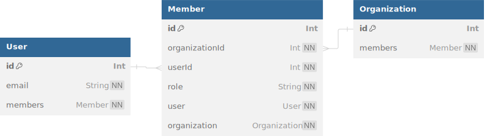

# Resolving Unique Constraint Errors

This guide will explain and resolve unique constraint errors that may occur when using @snaplet/seed to create relationships between entities.

## Getting Started

To begin, execute the following commands to clone the example repository, install dependencies, migrate your database, and initialize your seed data:

```bash
git clone git@github.com:snaplet/examples.git && cd examples/seed/unique-constraint-error
npm install
npx prisma migrate dev
npx @snaplet/seed init
```

## Database Structure

In this example, the `schema.prisma` file outlines the database structure with the following constraints:

**Unique Email Address for Each User**:
In the User model, the email field is marked with `@unique`.
This ensures that each user in the database has a unique email address, which means no two users can register with the same email. 
It directly reflects the UNIQUE constraint on the email column in the SQL schema.

**Unique Membership in Organizations**:
In the Member model, there are two unique constraints defined using the @@unique attribute.
The `constraint @@unique([organizationId, userId])` constraint ensures that a user can be a member of many organizations but cannot be a member of the same organization more than once.
It prevents duplicate memberships where the same user is associated with the same organization multiple times with different roles.



## Unique Constraint Error on scalars

When creating relationships between entities, you may encounter unique constraint errors if the data you are trying to insert violates the unique constraints defined in the database schema.
By default `@snaplet/seed` will try his best to link entites without violating the unique constraints, but in some cases, it may not be possible.

Here is such an example:

```typescript
import { createSeedClient } from "@snaplet/seed";

const seed = await createSeedClient();
await seed.$resetDatabase();

const user = await seed.User((x) => x(2, () => ({ email: 'a-static-user-email@gmail.com' })));
```

In this example, we are trying to create two users with the same email address, which violates the unique constraint defined on the email field in the User model.
This will raise a unique constraint error when the seed script is executed. Looking like this:

```bash
Error: Unique constraint "User_email_key" violated for model "User" on fields (email) with values (a-static-user-email@gmail.com)
Seed: 0/User/1
Model data: {
  "id": 2,
  "email": "a-static-user-email@gmail.com"
}
```

Here you can see which value was detected as a duplicate, and on which entity it was detected.

### How to fix it ?

First we need to understand how snaplet "solve" the constraint errors, it does so by trying multiples times to generate the data with a different "seed"
value to passed into the callback function, so to fix this issue we can simply pass a function that generates a email with the seed value in it for each user

```typescript
import { createSeedClient } from "@snaplet/seed";

const seed = await createSeedClient();
await seed.$resetDatabase();

const user = await seed.User((x) => x(2, ({ seed }) => ({ email: `a-static-user-email-${seed}@gmail.com` })));
```

In this example, we are using the `seed` value passed to the callback function to suffix the mail address and make it unique for each user.

## Unique Constraint Error on relationships

When creating relationships between entities, you may encounter unique constraint errors if the data you are trying to insert violates the unique constraints defined in the database schema.
By default `@snaplet/seed` will try his best to link entites without violating the unique constraints, but in some cases, it may not be possible.

For instance, if we have a pool of data with:

1. 2 users
2. 2 organizations

And we want to create members for each organization, we know that we can only maximum 2*2 possibilities.
Since a user cannot be present twice with the same organization in the table members.

So if we generate a seed script asking for more than 4 members, we will get a unique constraint error.

```typescript
import { createSeedClient } from "@snaplet/seed";

const seed = await createSeedClient();
await seed.$resetDatabase();

const { User } = await seed.User((x) => x(2));
const { Organization } = await seed.Organization((x) => x(2));

const members = await seed.Member((x) => x(5, () => ({
    role: 'MEMBER'
// We attempt to create 5 members from our pool of 2 users and 2 organizations
})), { connect: { User, Organization } });
```

This will raise a unique constraint error when the seed script is executed. Looking like this:

```bash
Error: Unique constraint "Member_organizationId_userId_key" violated for model "Member" on fields (organizationId,userId) with values (4,4)
Seed: 0/Member/4
Model data: {
  "organizationId": 4,
  "userId": 4,
  "id": 5,
  "role": "MEMBER"
}
```

### How to fix it ?

To fix this issue, we can adjust the script to ensure that the number of members created does not exceed the maximum number of unique combinations allowed by the unique constraints.
Either by incresing the pool of possibilities or by reducing the number of members created.

```typescript
import { createSeedClient } from "@snaplet/seed";

const seed = await createSeedClient();
await seed.$resetDatabase();

const { User } = await seed.User((x) => x(2));
// Let's use 3 organizations instead of 2
const { Organization } = await seed.Organization((x) => x(3));

// Now we can create maximum 2*3 = 6 members
const members = await seed.Member((x) => x(5, () => ({
    role: 'MEMBER'
})), { connect: { User, Organization } });
```